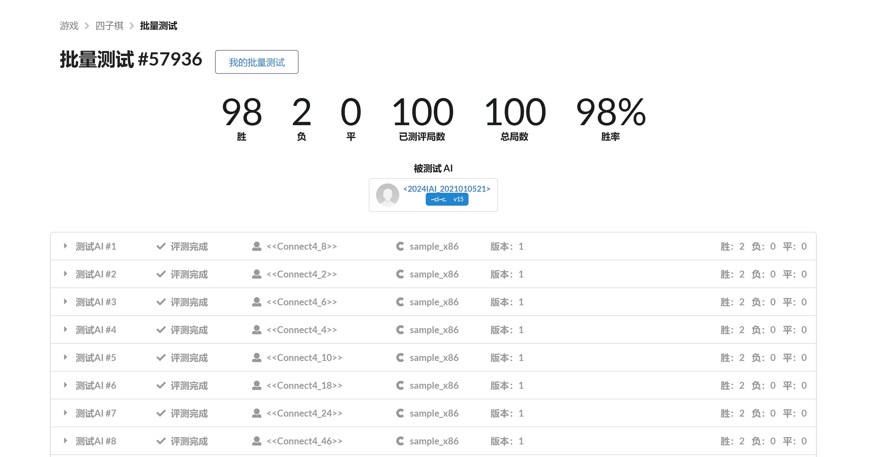
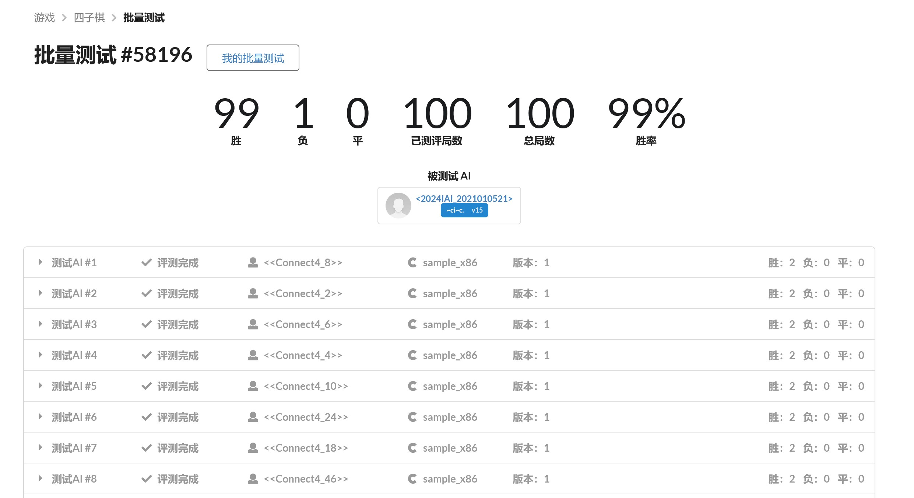
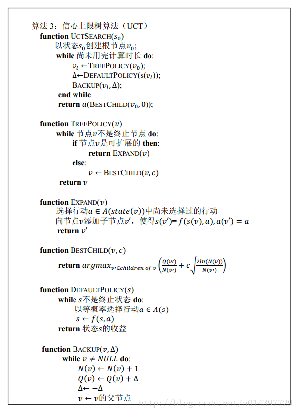

# 四子棋实验报告
刘雅迪
计26
2021010521

## 对抗结果的统计数据
### 本地
依次使用`bash compile.sh`、`bash compete.sh`和`python stat.py`指令，得到本地的测试结果如下：
|id|	wina|	winb|	losea|	loseb|	tie|	bug|	debug|	illegal|	deillegal|	timeout|	detimeout|	loaderr|	deloaderr|	noentry|	denoentry|
|-------|-------|-------|-------|-------|-------|-------|-------|-------|-------|-------|-------|-------|-------|-------|-------|
|2021010521|	48|	48|	1|	1|	0|	0|	0|	0|	0|	1|	1|	0|	0|	0|	0|

### 平台
选择在平台上结果较好的测试结果，如下：
| 测试 | 胜数 | 负数 | 平数 | 胜率 |
|-------|-------|-------|-------|-------|
| 测试1 | 98 | 2 | 0 | 98% |
| 测试2 | 99 | 1 | 0 | 99% |




## 策略与设计方式
使用信心上限树算法，将信心上限算法思想用于蒙特卡罗规划的特定算法中，从而更容易获得最优解。
### 信心上限树节点结构
```
struct UCTNode {
    int score; //当前节点的得分。由本节点拓展的棋局AI胜利加一分，对手胜利扣一分，平局分数不变
    int visit; //当前节点被访问的次数
    bool side; //当前棋局轮到谁下棋，side==true: AI, side==false: user
    int status; //当前棋局的状态。-1: AI失败; 0: 平局; 1: AI胜利; 2: 未结束
    int fa; //当前节点的父节点
    int child[2]; //当前节点的子节点
    int location[2]; //当前节点在棋盘上的位置

    UCTNode(){
        score = 0;
        visit = 0;
        side = true;
        status = 2;
        fa = 0;
        child[0] = child[1] = 0;
        location[0] = location[1] = 0;
    }
};
```
1. 通过在节点中记录得分和被访问的次数，便于计算信心上限的值，具体公式如下：
$\frac{child.score}{child.visit+0.0001}+c*\sqrt{\frac{2×log(father.visit+1.01)}{child.visit+0.001}}$
其中增加的常数是为了防止分数的分母为零或者根号下为零，c为调节参数。
2. 在节点中记录当前节点可能会被下到棋盘上的位置，便于通过TreePolicy来得到整个棋盘，从而减少内存的消耗。
3. 采用数组形式存节点的下标，0为初始节点下标值。

### 策略说明

首先说明几个概念：
* 必胜节点：当某方下在此位置时，将立即形成四连
* 迫手节点：当某方下在此位置时，逼迫对方马上应对，否则本方胜利 

具体策略：
在每次模拟中，先更新目前棋盘的状态，从根节点开始遍历，遍历完成后通过get_status函数获取当前点的状态，如果当前棋局的状态已定（如胜利、失败或平局），则回溯，逐层向上更新收益和访问次数至根节点，并进行下一次模拟。
若当前棋局的状态仍为未完成，则继续进行接下来的模拟过程：首先看棋盘中是否存在必胜节点，若存在，只扩展必胜节点，并回溯此次模拟结果，然后进行下一次模拟；若不存在必胜节点，则再看棋盘中是否存在迫手节点，若存在，只扩展迫手节点，否则的话扩展全部可能的节点。然后进行随机下棋模拟，此时并不扩展节点，模拟结束后进行回溯，然后进行下一次模拟。
在模拟结束后更新棋盘状态，**落子点的位置优先选择必胜节点，其次是迫手节点，最后才是胜率最高的节点**。

### 对于参数c的调节
|c|胜率|胜：负：平|
|-------|-------|-------|
|0.8|95%|95：5：0|
|0.7|98%|98：2：0|
|0.6|97%|97：3：0|
|0.5|90%|90：9：1|

在具体公式中c为调节参数，c的值越大，信心上限值会更加偏重于访问次数较少的子节点，下棋的下法也会相对比较大胆，反之则会比较保守。故笔者选择一个适中的c值，取c=0.7为最终参数。

## 实验感想
通过本次实验，我进一步了解了UCT算法，也亲自实现了一个胜率比较高的策略。在完成本实验过程中，我体会到了自己曾经所学的OOP知识已经快忘光了，比如在.h文件的前后加上"#ifndef"和"endif"，比如在不同文件中使用同一个变量要用extern等等，这些看似无关紧要的语法知识却成为了本实验前期的阻碍，以至于我debug了很久才迭代出一个运行不会报错的代码版本。
在设计策略时我仔细琢磨了规则，类似五子棋一样，我们肯定是优先下可以直接胜利的位置，如果没有下了就可以胜利的位置，那肯定接着找可以阻止对方直接胜利的位置，如果这些特殊位置都没有的话再下认为最可能会胜利的位置。我将这三条规则迁移到四子棋中，引入了必胜节点和迫手节点。一开始我通过遍历棋盘每列的方式找是否存在必胜节点或迫手节点，后来为了节省更多的时间改成了在上一个落子点的左右两列内找是否存在必胜节点或迫手节点，然而效果并不好，怀疑是因为棋盘列数的范围本来就比较小，所以遍历对时间的消耗影响不大。
在平台上测试时偶尔会出现TLE的结果，由于我在策略中已经将时间上限列为第一注意的事情（第二个是模拟的次数上限），即`while((std::chrono::duration<double>(std::chrono::steady_clock::now() - start).count() < 2.5) && im < 700000)`，一旦超过时间上限或模拟次数上限就立刻停止模拟并计算最后结果，后来将时间上限从2.5改为了1.7才勉强可以没有超时的问题，不明白这是因为我算法哪里的问题我没有考虑到还是平台上同时运行的程序过多导致资源分配有限，不过看群里助教说小概率的TLE只是会按比例扣分，所以在经过一番测试与调整后，将时间上限设置为2.3

## 参考资料
[UCT（信心上限树算法）解四子棋问题——蒙特卡罗法模拟人机博弈](https://blog.csdn.net/pql925/article/details/82180542)
[算法优化思路参考：屏风四子棋 | 天梯前四AI采访](https://www.sohu.com/a/392697294_722511)
